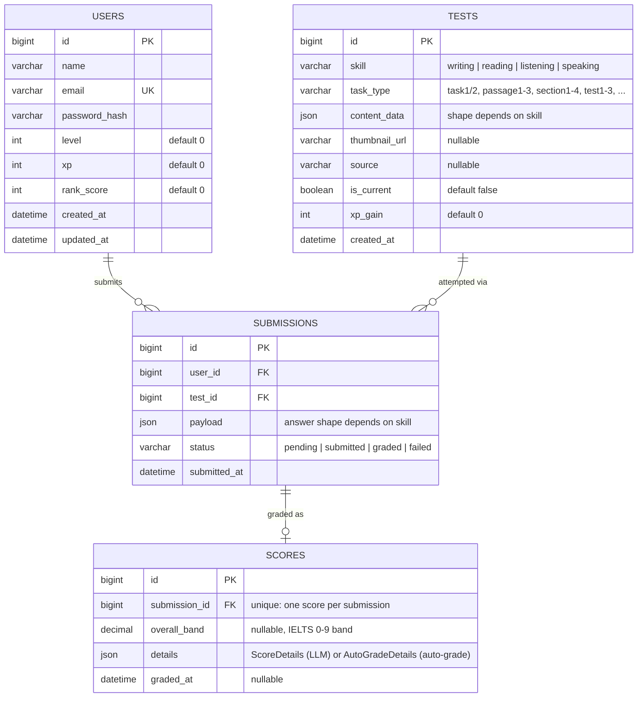

# Data Schema

Generated from the current migrations (`migrations/000001`–`000004`).



## `content_data`

`tests.content_data` is a single JSON column, but its shape is entirely determined by `tests.skill` — there's no separate table per skill (matches the polymorphic pattern IELTS naturally needs: four skills, four different "what does a test look like" answers, all living under one generic `tests` row). Full worked examples for each skill: [`writing_test.json`](writing_test.json), [`reading_test.json`](reading_test.json), [`listening_test.json`](listening_test.json) — each is a complete `POST /api/tests` request body.

### writing / speaking

```json
{ "prompt": "string, the task/question text", "image_url": "optional, Task 1 chart image" }
```
Simplest shape — a test is just a single prompt (`speaking` additionally has a `part` field for IELTS speaking part 1/2/3, unused by writing). Graded by the LLM (`internal/feature/ielts_test/grader.go`), so there's no answer key to redact.

### reading / listening

Both skills share the same `passages[]`/`sections[] -> question_groups[] -> questions[]` structure, laid out in full in **`docs/ielts-rl-data-structure.md`** (the authoring spec) — this section only documents how the Go backend (`internal/feature/ielts_test/models.go`, `autograde.go`) resolved that spec's ambiguities.

```json
{ "passages": [ { "title": "optional", "paragraphs": [ {"label", "text"} ], "question_groups": [ { "group_order", "question_type", "instructions", "questions": [ {"question_order", "text", "answer", "accepted_answers"} ], "...type-specific fields..." } ] } ] }
```
Listening mirrors this with `sections[]` instead of `passages[]`, plus **one shared `audio_url` for the whole test** at the `content_data` level (not per section) — each section instead carries `section_start_time`/`section_end_time` (seconds into that shared file).

- **`question_groups[].question_type`** — reading supports 14 types, listening supports 10 (6 shared between them: `multiple-choice`, `multiple-choice-multi`, `table-completion`, `flow-chart-completion`, `summary-completion`, `sentence-completion`); see `readingQuestionTypes`/`listeningQuestionTypes` in `models.go` for the exact sets. Every type-specific field (`shared_options`, `select_count`, `word_bank`, `summary_text`, `table_structure`, `note_structure`, `flow_structure`, `form_structure`, `diagram_image_url`, `map_image_url`, `location_key`) is documented per-type in `docs/ielts-rl-data-structure.md`.
- **`questions[].question_order`** — the identifier. There's no per-question string id in this shape; instead every question in the test carries a globally unique, contiguous integer (1..N, not reset per passage/section) — `AnswerPayload`/`AutoGradeDetails` key by `strconv.Itoa(question_order)`. `POST /api/tests` rejects duplicate or non-contiguous `question_order` values with a `400` at creation time (`validateQuestionOrderContinuity`). Note: this enforces contiguity from 1, not a fixed total of 40 — the app still supports partial/single-passage practice tests.
- **`questions[].answer`** vs **`accepted_answers`** — `answer` is the single canonical value shown in review UI; for fill-in-blank-style types (`sentence-completion`, `table/note/flow-chart/form-completion`, `short-answer`, `diagram-label-completion`, and `summary-completion` without a word bank) grading instead checks `accepted_answers[]`, which must always include `answer`'s own value (enforced at creation time). For single-key types (`true-false-not-given`, `multiple-choice`, the `matching-*` family, `matching`, `map-plan-labelling`, and `summary-completion` **with** a word bank) `answer` alone is graded, exact match, case-insensitive. For `multiple-choice-multi`, `answer` is a JSON array of keys, graded as an order-independent set match.
- Gap-bearing shared structures (`summary_text`, `table_structure.rows`, `note_structure.items`, `flow_structure.steps`, `form_structure.fields`) mark each blank with the literal string `"{{gap}}"`. `POST /api/tests` requires the gap count in a group's structure to exactly equal its question count (the i-th gap maps positionally to the i-th question) — a mismatch is rejected at creation time.
- **`map-plan-labelling`** hard-requires both `map_image_url` and `location_key` — a past bug shipped this type with neither, making the question unusable; `POST /api/tests` now rejects it outright.
- **`answer`/`accepted_answers`** are **never sent to the client**: `GET /api/tests`/`GET /api/tests/{id}` blank both fields before responding (`publicContentData`/`redactQuestionsInPlace`); they only reappear (as `correct_answer`) in a submission's score, after the candidate has already answered.
- **`questions[].timestamp_hint`** (listening only) — seconds into the shared `audio_url` where that question is addressed. It's a review-screen convenience only ("jump to the moment I got this wrong"), never used for grading and not surfaced during a live attempt.

### `payload` (submission) and `details` (score)

- **writing / speaking**: `payload = {text}` (the candidate's written/transcribed answer); `details = {criteria, corrections, model_answer}` — LLM-graded, one score per criterion (Task Achievement, Coherence, etc.).
- **reading / listening**: `payload = {answers: {questionOrder: value}}`, where `questionOrder` is the decimal-string form of `question_order` and `value` is a JSON string (single-answer types) or JSON array of strings (`multiple-choice-multi`); `details = {correct_count, total_count, results: {questionOrder: {correct, submitted_answer, correct_answer}}}`, where `submitted_answer`/`correct_answer` are always string arrays (single-element for single-answer types) so callers don't need to special-case multi-select display. Auto-graded, no LLM call — see `answersMatch` in `autograde.go` for the three grading rules (single-key exact match, accepted-answers membership, multi-select set match). `overall_band` is `correct_count/total_count` mapped through an IELTS-style percentage-to-band table (`bandFromRawScore`), so it works the same whether a test has a handful of questions or 40.
