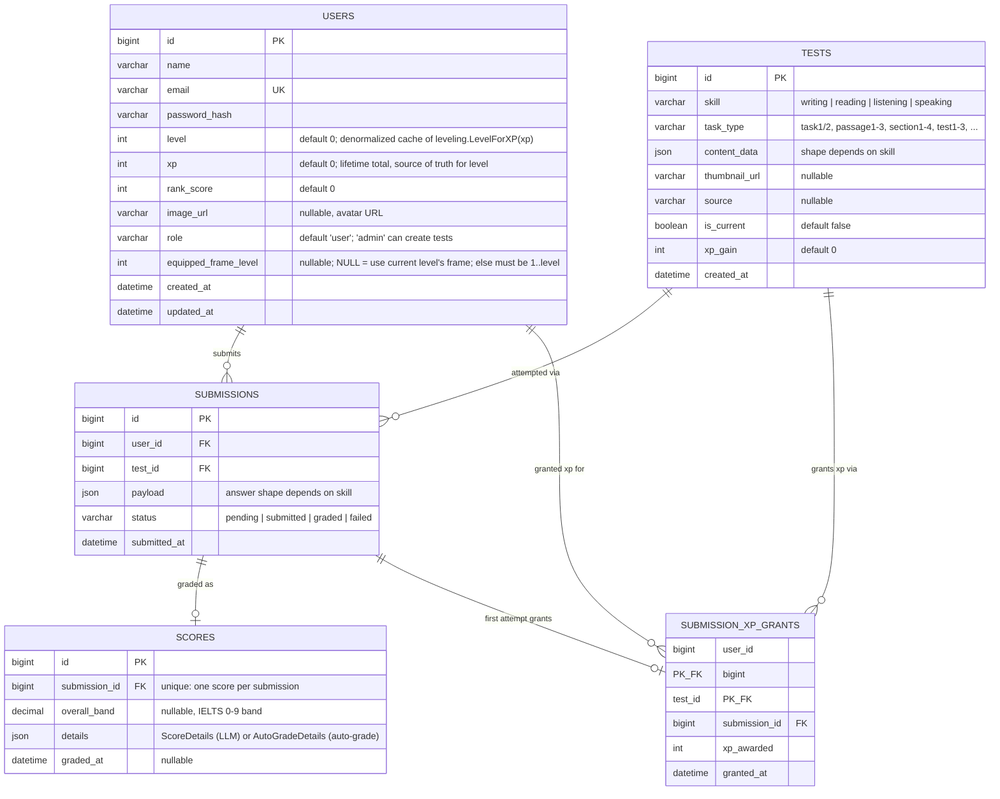

# Data Schema

Generated from the current migrations (`migrations/000001`–`000006`).



## `users`

`image_url` and `role` were added in migration `000005` (`add_image_url_and_role_to_users`). `equipped_frame_level` was added in migration `000006` (`add_profile_and_xp_grants`), which also created `submission_xp_grants`.

- **`image_url`** — nullable avatar URL. `internal/platform/auth` reads/writes it (`User.ImageURL` in `model.go`, threaded through `repository.go`'s `userColumns`/`Scan`/`INSERT`/`UPDATE`), and it round-trips through `/auth/register`/`/auth/login`/`/auth/refresh` responses. As of the profile HUD feature, it's also returned by `GET /api/profile` (`internal/feature/profile`) and rendered by the frontend's `ProfileHud` component, displayed inside the user's equipped avatar frame.
- **`role`** — `"user"` (default, set by `userRepository.CreateUser` whenever `Role` is empty) or `"admin"`. There's no API path to self-promote — an account only becomes admin via a direct DB update. The role is embedded in the JWT access/refresh token claims at login (`auth.Claims.Role`, set in `token.go`'s `generateToken`) rather than looked up per request, so `internal/platform/middleware.RequireAdmin` (layered on top of `RequireAuth`) can gate a route by checking `auth.CurrentUser(ctx).IsAdmin()` without a DB round-trip. Currently gates `POST /api/tests` (see `ielts_test/handler.go`'s `MountRoutes`) — creating tests is admin-only, everything else (listing/taking tests, submissions, scores) stays open to any authenticated user.
- **`level`/`xp`** — `xp` is the lifetime-total source of truth; `level` is a denormalized cache of `internal/platform/leveling.LevelForXP(xp)`, a 1–100 curve where each level-up costs 4% more XP than the previous one (compound growth, `leveling.go`). `level` is rewritten only by `auth.Repository.GrantIfFirstAttempt`, the sole XP-granting code path — it's called from `ielts_test.service.SubmitAnswer` after a submission's status becomes `graded`, using that test's `xp_gain`. There is no endpoint that accepts a client-supplied XP delta or level; `GET /api/profile` recomputes level live from `xp` for display rather than trusting the cached column, so a stale/corrupt cache can never reach what the user sees.
- **`equipped_frame_level`** — nullable; `NULL` means "display the frame matching the current level"; when set, must satisfy `1 <= value <= level` (enforced in `profile.service.SetEquippedFrame`, not a DB constraint — no `CHECK` constraints exist in this schema). A frame `N` (of the 100 avatar-frame images, one per level, served from `frontend/public/avatar-frames/`) is considered **unlocked** iff `N <= level` — this is fully derived from `level`, so there is no separate unlocks table. Changed via `PUT /api/profile/frame`.

## `submission_xp_grants`

Added in migration `000006`. Exists purely to make "XP is granted only for a user's first graded attempt at a given test" atomic and race-safe: its primary key is `(user_id, test_id)`, so `GrantIfFirstAttempt` attempts an `INSERT` and treats a primary-key violation as "already granted, skip." A boolean flag on `submissions` was considered and rejected — the `INSERT`-and-catch-duplicate-key approach enforces the invariant at the database level even under concurrent duplicate submissions, which a `SELECT`-then-`UPDATE` flag can't guarantee without extra locking. Resubmitting an already-attempted test is still allowed (for practice) and still gets graded normally — it just doesn't grant XP again.

## Profile / leveling API (`internal/feature/profile`)

- `GET /api/profile` — returns the current user's `name`, `level`, `xp`, `current_level_xp`, `xp_to_next_level`, `image_url`, `equipped_frame_level`, `unlocked_max_frame_level` (see `ProfileResponse` in `response.go`). Requires auth, no admin gate.
- `PUT /api/profile/frame` — body `{"frame_level": N}`; sets `equipped_frame_level` if `1 <= N <= level`, else `400 profile.frame_locked`. Cannot affect `xp`/`level`.
- This package has no table of its own — it reads/writes the same `users` row `internal/platform/auth.Repository` already owns, rather than duplicating a second gateway to it.

## `content_data`

`tests.content_data` is a single JSON column, but its shape is entirely determined by `tests.skill` — there's no separate table per skill (matches the polymorphic pattern IELTS naturally needs: four skills, four different "what does a test look like" answers, all living under one generic `tests` row). Full worked examples for each skill: [`writing_test.json`](writing_test.json), [`reading_test.json`](reading_test.json), [`listening_test.json`](listening_test.json) — each is a complete `POST /api/tests` request body.

### writing / speaking

```json
{ "prompt": "string, the task/question text", "image_url": "optional, Task 1 chart image" }
```
Simplest shape — a test is just a single prompt (`speaking` additionally has a `part` field for IELTS speaking part 1/2/3, unused by writing). Graded by the LLM (`internal/feature/ielts_test/grader.go`), so there's no answer key to redact.

### reading / listening

Both skills share the same `passages[]`/`sections[] -> question_groups[] -> questions[]` structure, laid out in full in **`docs/ielts-rl-data-structure.md`** (the authoring spec) — this section only documents how the Go backend (`internal/feature/ielts_test/models.go`, `autograde.go`) resolved that spec's ambiguities.

```json
{ "passages": [ { "title": "optional", "paragraphs": [ {"label", "text"} ], "question_groups": [ { "group_order", "question_type", "instructions", "questions": [ {"question_order", "text", "answer", "accepted_answers"} ], "...type-specific fields..." } ] } ] }
```
Listening mirrors this with `sections[]` instead of `passages[]`, plus **one shared `audio_url` for the whole test** at the `content_data` level (not per section) — each section instead carries `section_start_time`/`section_end_time` (seconds into that shared file).

- **`question_groups[].question_type`** — reading supports 14 types, listening supports 10 (6 shared between them: `multiple-choice`, `multiple-choice-multi`, `table-completion`, `flow-chart-completion`, `summary-completion`, `sentence-completion`); see `readingQuestionTypes`/`listeningQuestionTypes` in `models.go` for the exact sets. Every type-specific field (`shared_options`, `select_count`, `word_bank`, `summary_text`, `table_structure`, `note_structure`, `flow_structure`, `form_structure`, `diagram_image_url`, `map_image_url`, `location_key`) is documented per-type in `docs/ielts-rl-data-structure.md`.
- **`questions[].question_order`** — the identifier. There's no per-question string id in this shape; instead every question in the test carries a globally unique, contiguous integer (1..N, not reset per passage/section) — `AnswerPayload`/`AutoGradeDetails` key by `strconv.Itoa(question_order)`. `POST /api/tests` rejects duplicate or non-contiguous `question_order` values with a `400` at creation time (`validateQuestionOrderContinuity`). Note: this enforces contiguity from 1, not a fixed total of 40 — the app still supports partial/single-passage practice tests.
- **`questions[].answer`** vs **`accepted_answers`** — `answer` is the single canonical value shown in review UI; for fill-in-blank-style types (`sentence-completion`, `table/note/flow-chart/form-completion`, `short-answer`, `diagram-label-completion`, and `summary-completion` without a word bank) grading instead checks `accepted_answers[]`, which must always include `answer`'s own value (enforced at creation time). For single-key types (`true-false-not-given`, `multiple-choice`, the `matching-*` family, `matching`, `map-plan-labelling`, and `summary-completion` **with** a word bank) `answer` alone is graded, exact match, case-insensitive. For `multiple-choice-multi`, `answer` is a JSON array of keys, graded as an order-independent set match.
- Gap-bearing shared structures (`summary_text`, `table_structure.rows`, `note_structure.items`, `flow_structure.steps`, `form_structure.fields`) mark each blank with the literal string `"{{gap}}"`. `POST /api/tests` requires the gap count in a group's structure to exactly equal its question count (the i-th gap maps positionally to the i-th question) — a mismatch is rejected at creation time.
- **`map-plan-labelling`** hard-requires both `map_image_url` and `location_key` — a past bug shipped this type with neither, making the question unusable; `POST /api/tests` now rejects it outright.
- **`answer`/`accepted_answers`** are **never sent to the client**: `GET /api/tests`/`GET /api/tests/{id}` blank both fields before responding (`publicContentData`/`redactQuestionsInPlace`); they only reappear (as `correct_answer`) in a submission's score, after the candidate has already answered.
- **`questions[].timestamp_hint`** (listening only) — seconds into the shared `audio_url` where that question is addressed. It's a review-screen convenience only ("jump to the moment I got this wrong"), never used for grading and not surfaced during a live attempt.

### `payload` (submission) and `details` (score)

- **writing / speaking**: `payload = {text}` (the candidate's written/transcribed answer); `details = {criteria, corrections, model_answer}` — LLM-graded, one score per criterion (Task Achievement, Coherence, etc.).
- **reading / listening**: `payload = {answers: {questionOrder: value}}`, where `questionOrder` is the decimal-string form of `question_order` and `value` is a JSON string (single-answer types) or JSON array of strings (`multiple-choice-multi`); `details = {correct_count, total_count, results: {questionOrder: {correct, submitted_answer, correct_answer}}}`, where `submitted_answer`/`correct_answer` are always string arrays (single-element for single-answer types) so callers don't need to special-case multi-select display. Auto-graded, no LLM call — see `answersMatch` in `autograde.go` for the three grading rules (single-key exact match, accepted-answers membership, multi-select set match). `overall_band` is `correct_count/total_count` mapped through an IELTS-style percentage-to-band table (`bandFromRawScore`), so it works the same whether a test has a handful of questions or 40.
